# DCT-Pro 数字图像水印研究项目（公开演示仓库）

> DCT-Pro Image Watermarking Research Workbench — visualization, documentation, and a Windows executable demo.

## 研究成果与攻击测试报告

最新批量实验结果（2026-08-03）已发布：[**《研究成果与攻击测试报告》**](docs/RESEARCH_RESULTS.md)，覆盖 500 张图像、6 组配置、30 种攻击测试，包含热力图、攻击矩阵、实验日志与 CSV 原始数据。

## Project Status

`Research prototype` · 持续迭代中（Active development）

## Overview

本仓库公开数字图像水印研究的**交互式算法可视化**、**完整图文操作手册**与 **Windows 可执行演示程序**。研究实现的源代码不在公开范围内。

> 本仓库公开研究说明、交互式算法可视化和 Windows 可执行演示程序，研究实现源码不在公开范围内。

## Public Resources

- **完整图文操作手册**：本 README 即程序《图像数字水印嵌入与鲁棒检测提取系统》的完整操作手册（含界面截图）；
- **交互式可视化**：`index.html`，浏览器直接打开；
- **研究成果与攻击测试结果**：[实验数据与图表](docs/RESEARCH_RESULTS.md)（含热力图、Preset 消融对比、CSV 原始数据）；
- **Windows 可执行程序**：GitHub Release 提供 `v13_ex.exe`。

## Download

| 项目 | 值 |
|---|---|
| Release | `v13.0` — DCT-Pro Research Workbench v13 for Windows |
| 文件名 | `v13_ex.exe` |
| 文件大小 | 172,821,504 字节（约 165 MB） |
| SHA-256 | `FA780292E6D579AE0659E9BC67A4AAA11B34B2D5698C2A11BDA6C12E31526C5C` |
| 支持系统 | Windows 10 / Windows 11 桌面端（无需安装 Python） |

下载入口：[GitHub Release v13.0](https://github.com/yhwlwl/watermark/releases/tag/v13.0)

## Source Availability

This repository provides public documentation, an interactive visualization, and a compiled Windows demo. The source code of the research implementation is not included.

本仓库公开研究说明、交互式算法可视化和 Windows 可执行演示程序，研究实现源码不在公开范围内。本仓库不是开源算法实现仓库，也不包含源码授权。

---

# 图像数字水印嵌入与鲁棒检测提取系统（操作手册）

# 图像数字水印嵌入与鲁棒检测提取系统
版本：V13.0
## 一、 软件概述
图像数字水印嵌入与鲁棒检测提取系统是一款用于图像数字水印嵌入、盲提取与鲁棒性评测的桌面软件。软件提供统一的图形界面，用户可在同一套流程中完成水印嵌入、对抗攻击仿真、提取验证与报告导出，用于教学演示、实验复现与传播场景下的水印可检测性验证。
软件内置多种水印方案用于对比与实验：LSB（空间域基线）、DCT（中频系数比较）与 DCT‑Pro（全息平铺增强方案），同时提供显性水印用于肉眼对比。软件在嵌入阶段同步输出 PSNR/SSIM 等图像质量指标，便于在“不可见性”与“鲁棒性”之间做取舍。

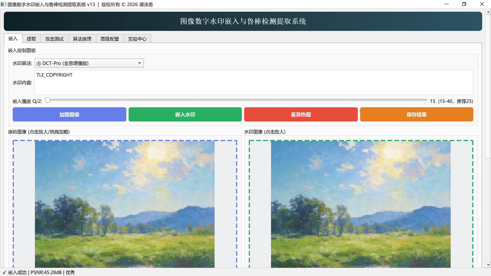

## 二、 运行与安装环境
运行平台
操作系统：Windows 10/Windows 11（桌面端）
运行方式：直接运行已打包的 `v13_ex.exe`
运行支撑环境 / 支持软件
独立打包的可执行文件，无需安装 Python 或额外依赖
启动方法（示例）
启动方法
双击 `v13_ex.exe` 即可运行
## 三、 水印嵌入（“嵌入”页）
“嵌入”页用于生成水印图像，并输出图像质量指标。该页包含“原始图像”和“水印图像”两块预览区，支持拖拽加载与点击放大查看，便于确认图像细节是否发生明显变化。
加载图像
点击“加载图像”，选择本地图片文件；或将图片文件拖拽到“原始图像”预览框。
加载成功后，界面显示原始图像缩略预览，并在状态栏提示图片尺寸。
选择算法与填写水印内容
在“水印算法”下拉框中选择水印方式：
DCT‑Pro（全息增强版）：用于鲁棒性评测与传播场景验证。
DCT（经典 Cox）：用于对比 JPEG/缩放等常见攻击下的鲁棒性。
LSB：用于空间域基线对比（对压缩、裁剪较脆弱）。
Visible：用于显性水印视觉对比（通常不可盲提取）。
在“水印内容”中输入水印文本（建议使用短英文/数字，便于对比实验）。
设置参数并执行嵌入
隐水印：使用“嵌入强度”滑块设置强度后点击“嵌入水印”。
显水印：使用“透明度”滑块设置透明度后点击“嵌入水印”。
嵌入完成后，界面显示“水印图像”，并在“图像质量评估”区域展示 PSNR/SSIM 指标与柱状图。
可选：差异热图与保存结果
点击“差异热图”，查看嵌入前后在亮度通道上的差异可视化（用于观察修改分布）。
点击“保存结果”，将水印图像导出为 PNG 或 JPEG 文件。

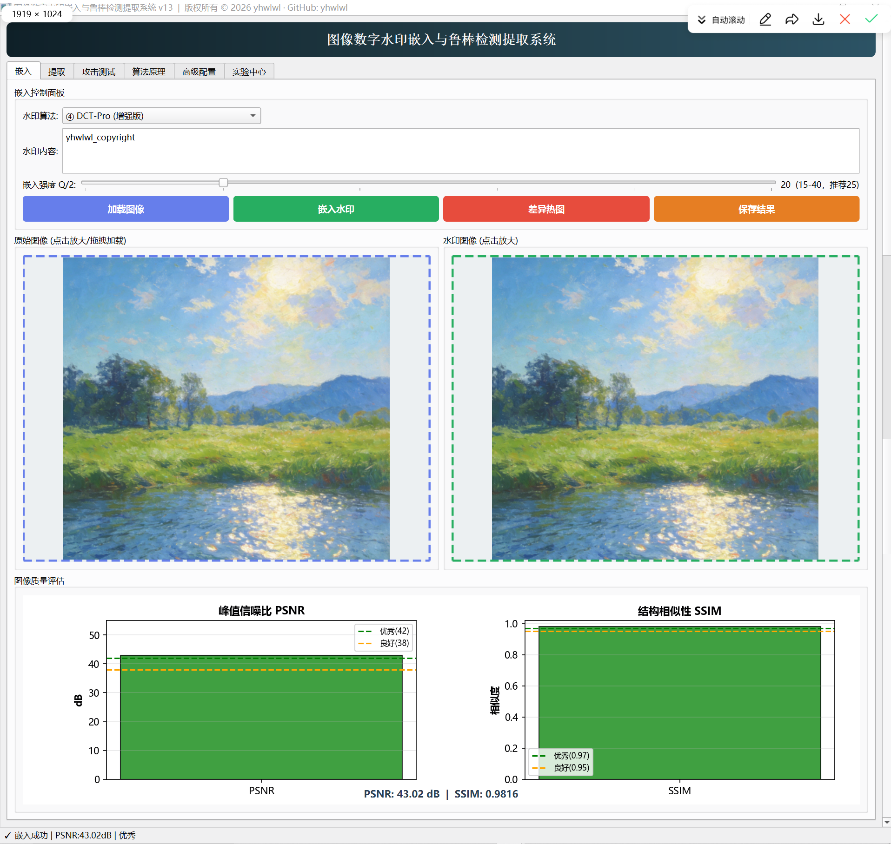

## 四、 水印提取（“提取”页）
“提取”页用于对水印图或受攻击后的图像进行盲提取，并输出检测报告。为保证结果可复现，提取算法应与嵌入时保持一致。
加载待检测图像
点击“加载图像”，选择需要检测的水印图或攻击后图像；或将图片拖拽到“待检测图像”预览框。
选择算法并执行提取
在“算法”下拉框中选择对应算法（DCT‑Pro / DCT / LSB）。
点击“提取”后，系统在右侧“检测报告”区域显示提取结果与失败原因提示（若未提取到水印）。
结果判读建议
若提取文本与嵌入文本一致，通常判定为水印仍可检测。
若提取到部分文本或出现少量误码，可结合攻击强度与测试目的综合判断（例如“可识别性”与“完全一致性”的要求不同）。

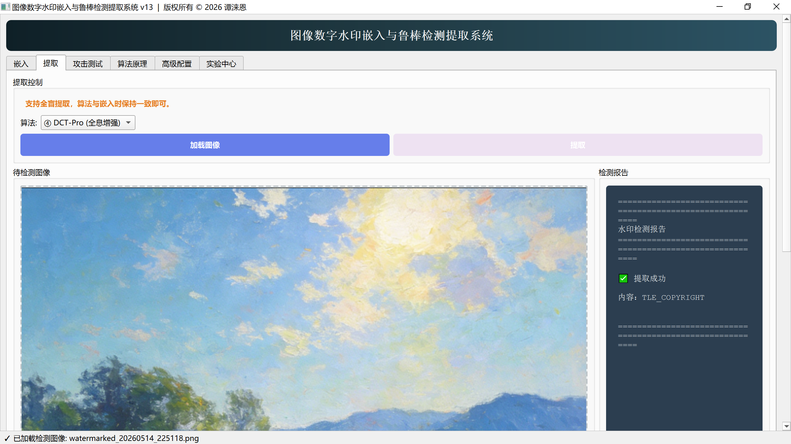

## 五、 攻击测试与算法对比（“攻击测试”页）
“攻击测试”页用于模拟常见传播破坏（压缩、缩放、噪声、亮度变化、旋转、滤波、裁剪/遮挡等），并对受攻击图像进行自动提取验证。该页同时支持批量评测与三算法对比，便于形成实验结论。
### 1、 单项攻击
选择测试算法与攻击类型
在“测试算法”中选择与当前水印图对应的算法。
在“单项攻击”下拉列表中选择攻击类型（例如 JPEG 压缩、缩放、噪声、裁剪等）。
执行攻击并查看结果
点击“执行攻击”，系统对当前水印图实施攻击并尝试自动提取。
右侧结果面板显示“攻击名称、算法、提取结果与判定”；右侧预览区显示“攻击前/攻击后”缩略图，并可点击“展开对比”查看大图。

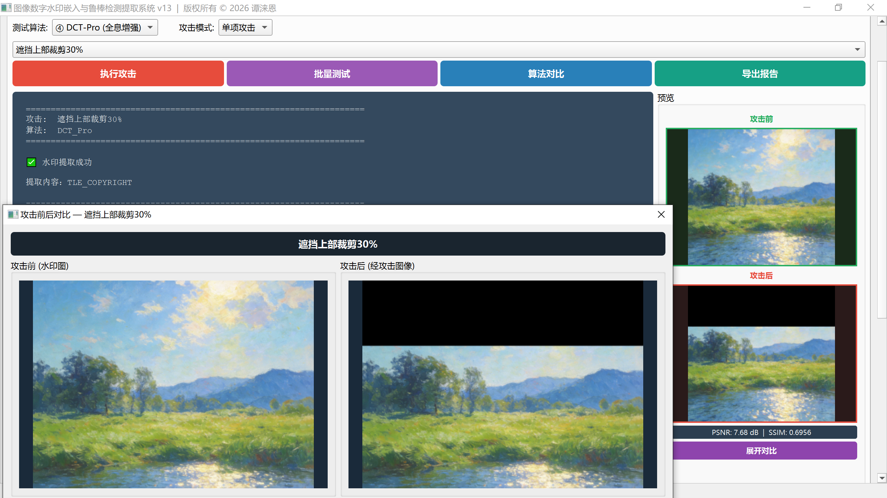

### 2、批量测试
批量测试用于对一组攻击进行统一评测，输出通过率与逐项结果。
点击“批量测试”后，系统按攻击集合逐项执行攻击与提取，实时输出每项攻击的结果行。
测试结束后显示总体成功率，并可点击“浏览攻击结果”查看每种攻击的结果图与对比。

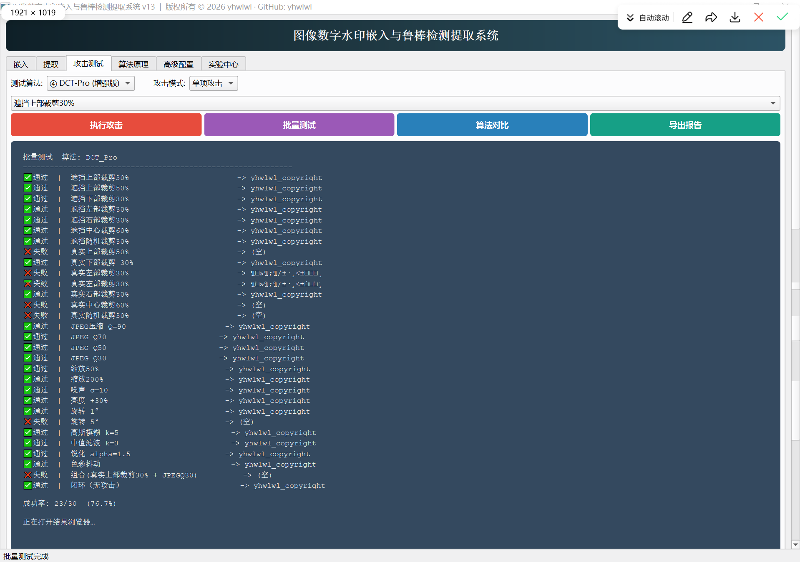

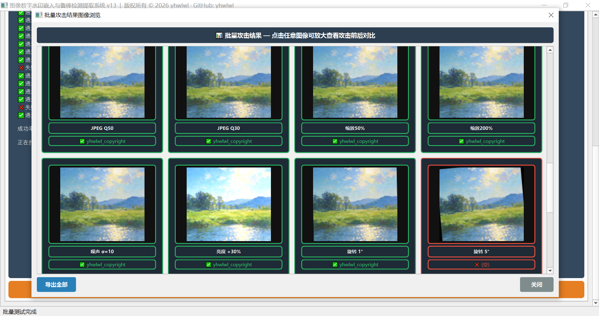

### 3、 组合攻击（流水线）
组合攻击用于模拟多步骤传播破坏（例如裁剪后再压缩、缩放后再加噪声等）。
在“攻击原语”中选择攻击并设置参数，点击“添加到流水线”组成攻击序列。
点击“执行”仅执行攻击；点击“单算法攻击”会在执行后自动提取并给出判定。
可将组合攻击保存到实验中心，便于后续复用与对比。

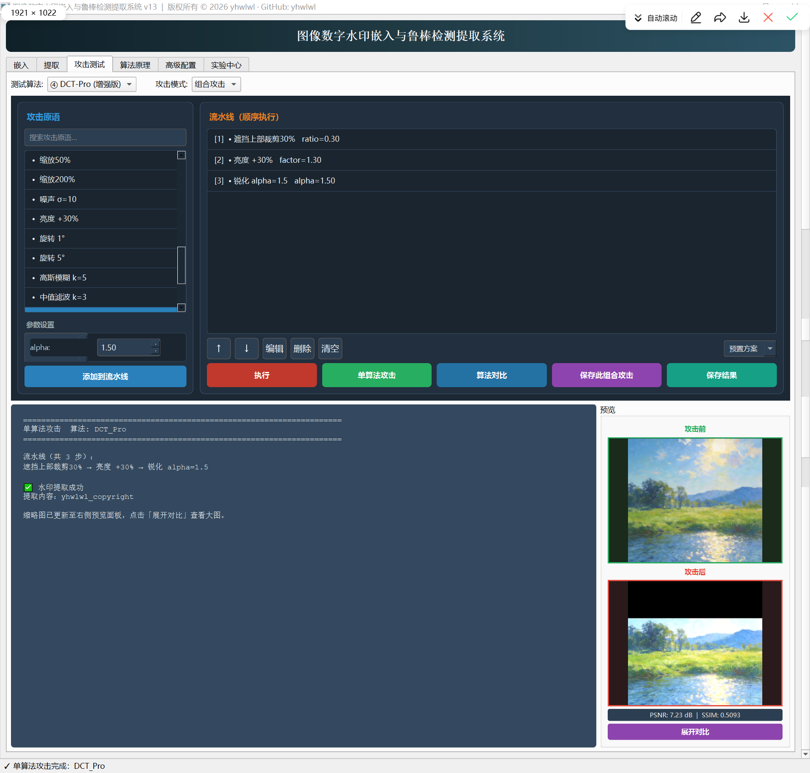

### 4、 三算法对比与报告导出
点击“算法对比”后，系统对同一攻击集合分别测试 LSB、DCT、DCT‑Pro 的提取表现，并生成对比报告。
点击“导出报告”可将结果保存为 Markdown 文本，并生成对应的图片版报告，便于归档与提交。

## 配置页面

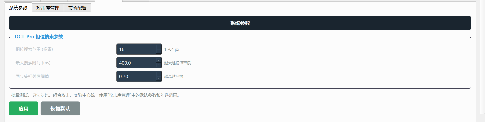

配置页面分为通用配置，攻击库配置（管理所有攻击类别），实验配置（管理实验中心相关参数）

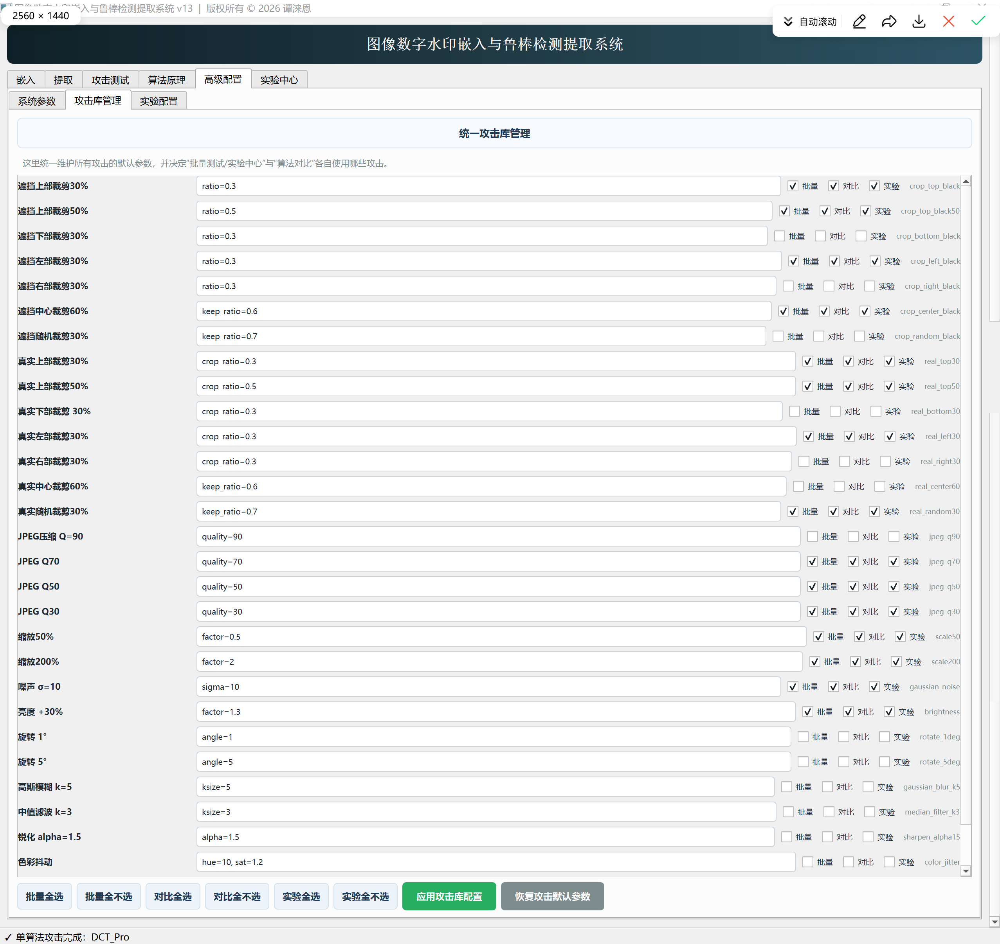

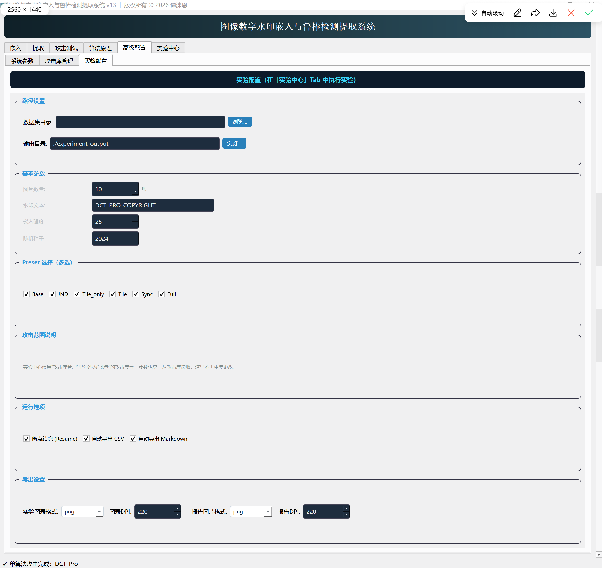

## 实验中心与批量测试（“实验中心”页）
在此标签页，点击开始按钮后，系统会根据配置，批量进行消融实验，最终并输出结果图像。

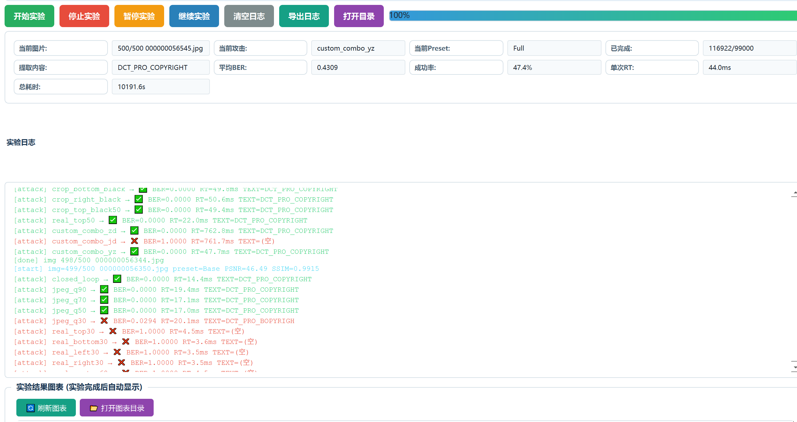

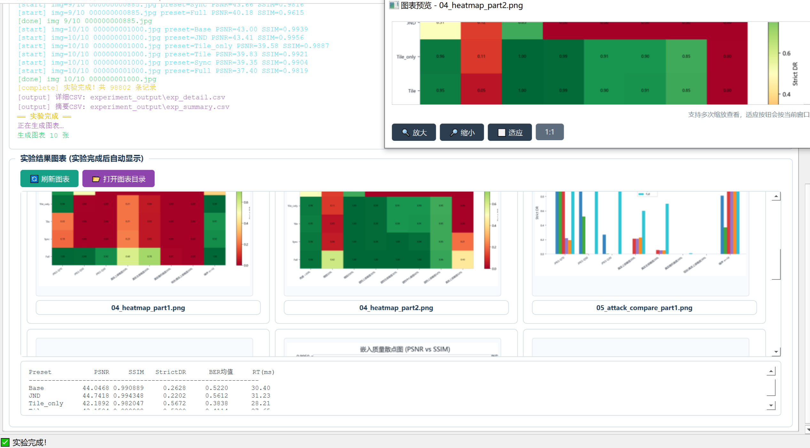

## 八. 注意事项与常见问题
算法一致性
嵌入与提取时的算法必须保持一致，否则即使图像包含水印也可能无法正确提取。
图像尺寸与容量
图像尺寸过小会限制可嵌入的数据量；建议使用清晰度较高、尺寸适中的图片进行对比实验。
攻击强度与实验口径
不同攻击（例如真实裁剪与遮挡裁剪）对定位与同步影响不同。进行对比实验时建议固定攻击参数与测试集合，保持可复现性。
报告文件位置
软件生成的报告通常保存在项目目录的 `attack_reports/` 等输出目录中；导出报告时可按提示选择保存路径。

---

## 免责声明

- 本程序仅用于研究与教育目的，不是商业产品；
- 鲁棒性取决于参数、图像内容和攻击类型，单次成功不代表对所有图像和攻击有效；
- PSNR、SSIM 与提取成功率应结合实验条件理解；
- 不应将其包装成不可移除或不可破解的绝对版权保护系统；
- 使用者应只处理自己拥有权利或获得授权的图像；
- 不得用于伪造版权、隐蔽追踪或未经授权的数据标记；
- 程序未进行商业代码签名，Windows SmartScreen 可能显示未知发布者提示；请只从本仓库官方 Release 下载，并使用上方 SHA-256 核对文件完整性。

## Documentation

- [研究成果与攻击测试结果](docs/RESEARCH_RESULTS.md)
- [Release 说明](docs/RELEASE_NOTES_v13.md)
