# DCT-Pro 研究成果与攻击测试结果

> 本页汇总 DCT-Pro 数字图像水印研究中的实验设置、量化指标、攻击测试结果与可视化图表。所有图片与 CSV 均由实验工具直接导出，可下载复查。

## 1. 实验总览

| 项目 | 说明 |
|---|---|
| 水印内容 | `DCT_PRO_COPYRIGHT`（短文本） |
| 测试图像 | 20 张/组（每项攻击 n=20） |
| 对比算法 | LSB（空间域基线）、DCT（经典中频系数调制）、DCT-Pro（全增强版） |
| 攻击类型 | JPEG 压缩、缩放、噪声、亮度、遮挡/真实裁剪、组合攻击等 30 余种 |
| 评价指标 | PSNR / SSIM、严格检测率（Strict DR）、软检测率（Soft DR）、BER、运行耗时（ms） |

## 2. 核心结论

- **算法对比矩阵（16 类攻击 × 20 张图）**：DCT-Pro 综合严格检测率 **63.75%**，显著高于 DCT 的 26.25%，LSB 为 0%；平均 BER 分别为 0.350 / 0.537 / 1.000。
- **30 项攻击综合报告**：DCT-Pro **22/30** 通过，DCT 11/30，LSB 0/30。
- **强项**：JPEG Q30 仍保持 95% 严格检测率；缩放 200%、噪声 σ=10、亮度 +30%、遮挡裁剪等攻击下可 100% 提取。
- **短板**：真实裁剪（中心 60%、随机 30%）、组合攻击（上裁 30% + JPEG Q30）与旋转（1°/5°）仍会失败，是后续优化的重点方向。

## 3. 算法横向对比（LSB / DCT / DCT-Pro）

### 3.1 总体指标

数据来源：`algorithm_attack_matrix_summary.csv`（16 类攻击，每类 20 张图）。

| 指标 | LSB | DCT | DCT-Pro |
|---|---|---:|---:|
| 严格检测率（Strict DR） | 0.00% | 26.25% | **63.75%** |
| 软检测率（Soft DR） | 0.00% | 28.75% | **64.06%** |
| 平均 BER | 1.000 | 0.537 | **0.350** |
| 平均提取耗时 | 0.7 ms | 46.9 ms | 148.2 ms |

### 3.2 分攻击明细（Strict DR / BER）

| 攻击类型 | LSB | DCT | DCT-Pro | DCT-Pro 耗时 (ms) |
|---|---|---|---:|---:|
| 上裁 30%（遮挡） | 0.0 / 1.000 | 0.0 / 0.235 | **1.0 / 0.000** | 69.5 |
| 上裁 30%（真实） | 0.0 / 1.000 | 0.0 / 1.000 | 0.3 / 0.675 | 128.4 |
| 上裁 50%（遮挡） | 0.0 / 1.000 | 0.0 / 0.357 | **0.9 / 0.072** | 79.3 |
| 上裁 50%（真实） | 0.0 / 1.000 | 0.0 / 1.000 | 0.25 / 0.750 | 95.8 |
| 左裁 30%（遮挡） | 0.0 / 1.000 | 0.0 / 0.124 | **1.0 / 0.000** | 85.1 |
| 左裁 30%（真实） | 0.0 / 1.000 | 0.0 / 1.000 | 0.1 / 0.873 | 165.9 |
| 中心 60%（截图） | 0.0 / 1.000 | 0.0 / 1.000 | 0.2 / 0.773 | 78.6 |
| 随机 30%（真实） | 0.0 / 1.000 | 0.0 / 1.000 | 0.0 / 1.000 | 148.6 |
| 组合攻击（上裁 30% + JPEG Q30） | 0.0 / 1.000 | 0.0 / 1.000 | 0.0 / 1.000 | 202.4 |
| JPEG Q70 | 0.0 / 1.000 | 0.9 / 0.072 | **0.95 / 0.002** | 290.3 |
| JPEG Q50 | 0.0 / 1.000 | 0.85 / 0.122 | **1.0 / 0.000** | 208.7 |
| JPEG Q30 | 0.0 / 1.000 | 0.1 / 0.482 | **0.95 / 0.050** | 250.3 |
| 缩放 50% | 0.0 / 1.000 | 0.1 / 0.663 | 0.55 / 0.398 | 235.4 |
| 缩放 200% | 0.0 / 1.000 | 0.8 / 0.144 | **1.0 / 0.000** | 96.1 |
| 噪声 σ=10 | 0.0 / 1.000 | 0.8 / 0.127 | **1.0 / 0.000** | 169.2 |
| 亮度 +30% | 0.0 / 1.000 | 0.65 / 0.273 | **1.0 / 0.000** | 68.4 |

## 4. 攻击测试报告

### 4.1 最新综合报告（30 项攻击）

**综合得分：DCT-Pro 22/30，DCT 11/30，LSB 0/30**

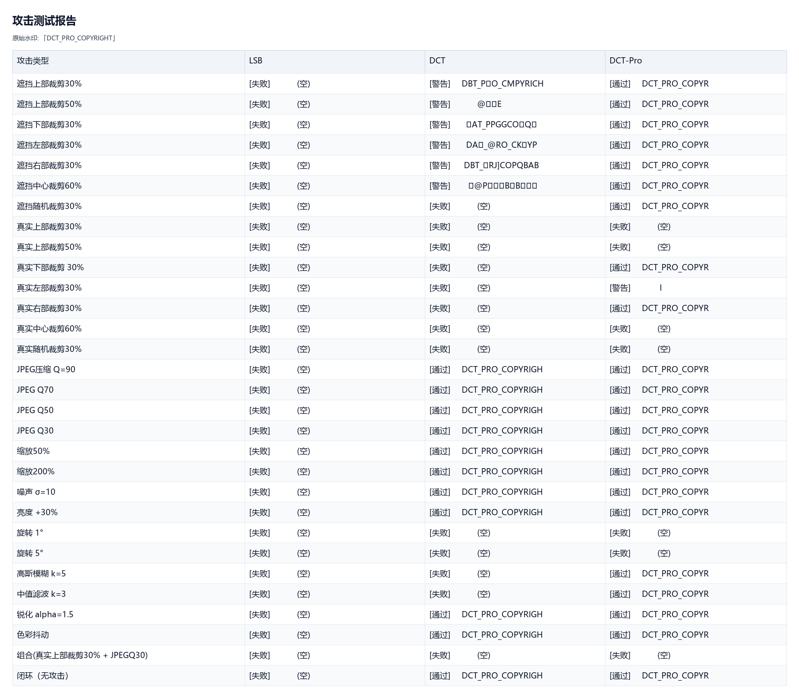

报告文本：[Attack_Report_20260510_213024.md](experiments/reports/Attack_Report_20260510_213024.md)

### 4.2 历史报告（迭代过程）

- [2026-05-10 18:26 DCT-Pro 批量测试（12/17）](experiments/reports/Attack_Report_20260510_182605.md)
- [2026-05-10 18:26 算法对比（17 项攻击）](experiments/reports/Attack_Report_20260510_182653.md)
- [2026-05-10 18:46 滤波类攻击补充（高斯模糊 / 中值滤波）](experiments/reports/Attack_Report_20260510_184656.md)
- [2026-05-10 18:52 DCT-Pro 批量测试（12/16）](experiments/reports/Attack_Report_20260510_185232.md)
- [2026-05-10 18:52 算法对比（16 项攻击）](experiments/reports/Attack_Report_20260510_185255.md)
- [2026-05-10 21:04 算法对比（16 项攻击）](experiments/reports/Attack_Report_20260510_210434.md)

## 5. 消融实验（Preset 对比）

消融实验依次叠加 JND → Tile → Sync → Full 等模块，评估各模块对鲁棒性与图像质量的贡献。下表和图来自 v8 实验快照（`v8_stats_summary.csv`）。

| Preset | PSNR (dB) | SSIM | Strict DR | Soft DR | BER | 耗时均值 / P95 (ms) |
|---|---:|---:|---:|---:|---:|---:|
| Base | 44.02 | 0.9914 | 14.3% | 17.9% | 0.791 | 45.3 / 17.2 |
| JND | 44.61 | 0.9946 | 13.6% | 13.6% | 0.848 | 23.7 / 15.8 |
| Tile_only | 41.86 | 0.9814 | 18.6% | 18.6% | 0.719 | 24.9 / 71.9 |
| Tile | 42.74 | 0.9894 | 18.6% | 18.6% | 0.716 | 42.7 / 103.6 |
| Sync | 41.84 | 0.9871 | 22.1% | 22.1% | 0.779 | 56.9 / 179.7 |
| **Full** | 38.94 | 0.9744 | **52.1%** | **52.1%** | **0.475** | 573.7 / 1503.3 |

结论：**Full（全增强版）鲁棒性最高**，Strict DR 从 Base 的 14.3% 提升到 52.1%；JND 在保持最高图像质量（SSIM 0.9946）的同时换取少量鲁棒性；完整方案的代价是提取耗时显著上升。

## 6. 热力图与可视化图表

### 6.1 整体指标

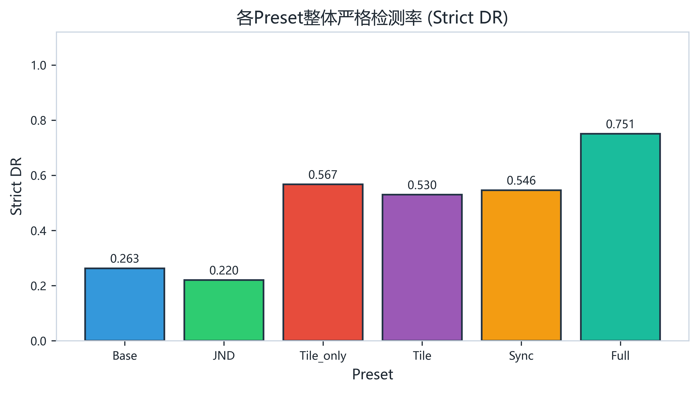

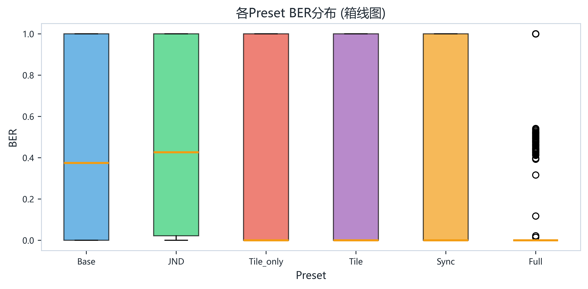

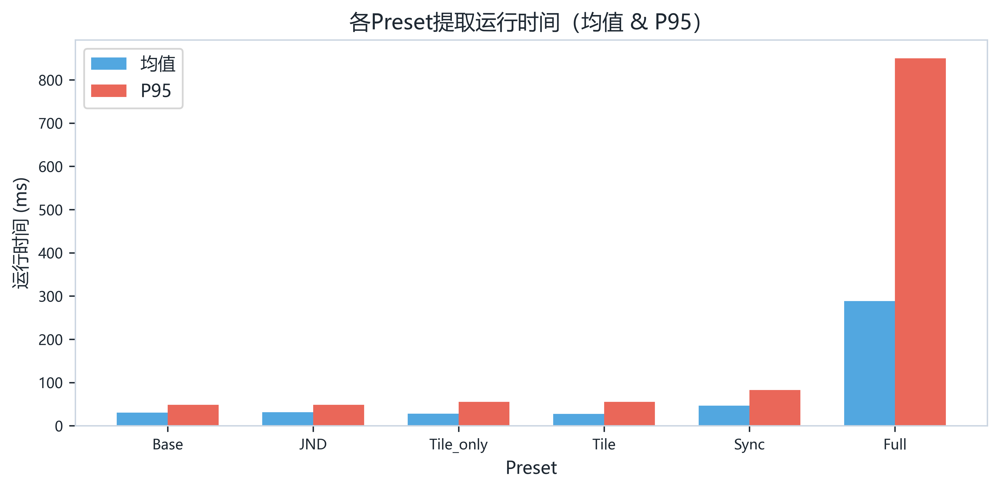

### 6.2 热力图（Preset × 攻击 严格检测率）

热力图颜色：绿色 = 1.0（全部通过），红色 = 0.0（全部失败）。按攻击类型分为 4 组展示。

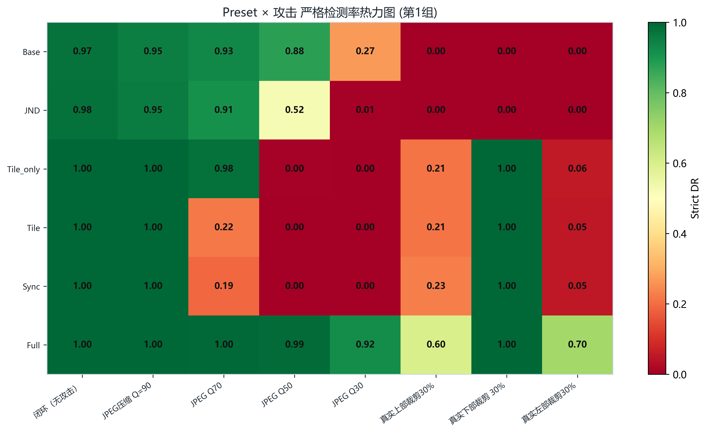

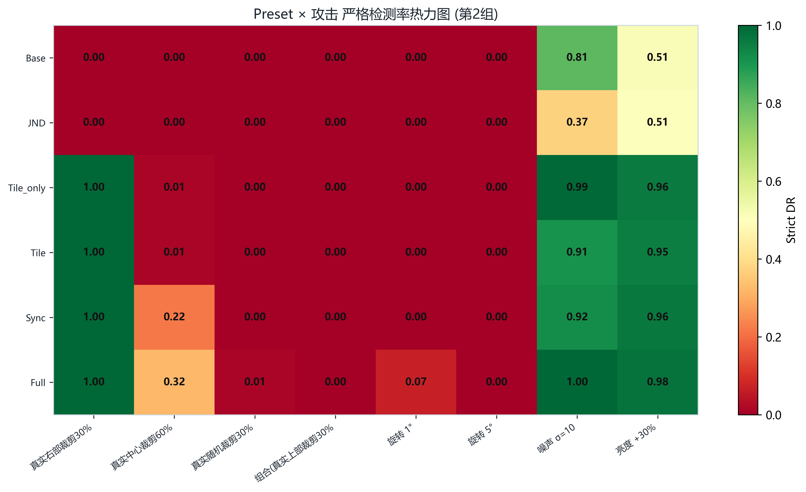

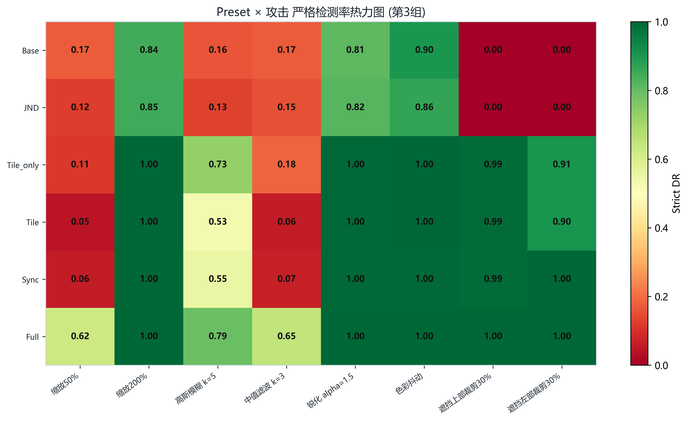

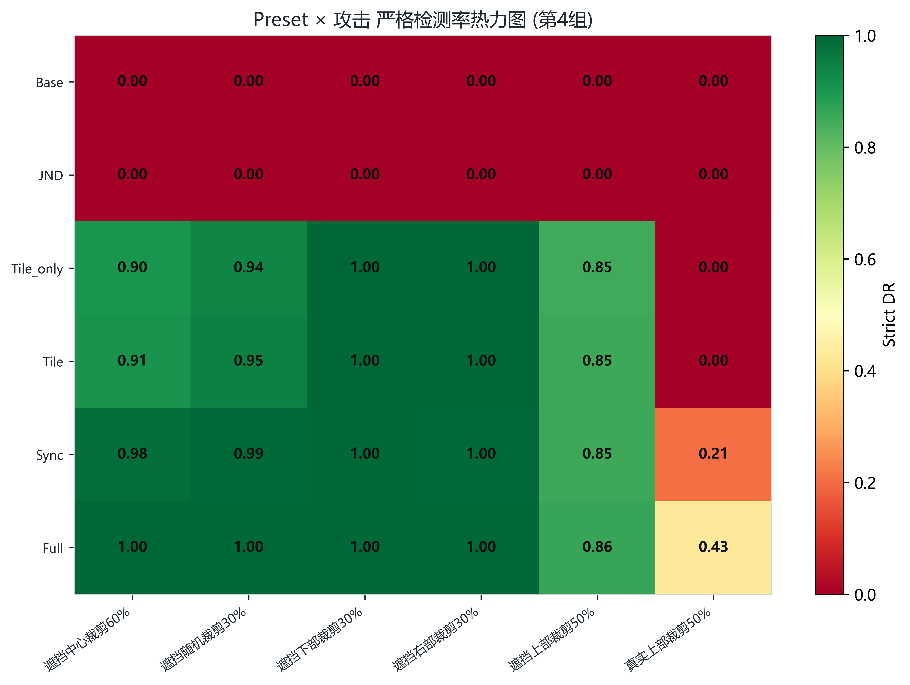

### 6.3 各攻击方式 × Preset 成功率对比

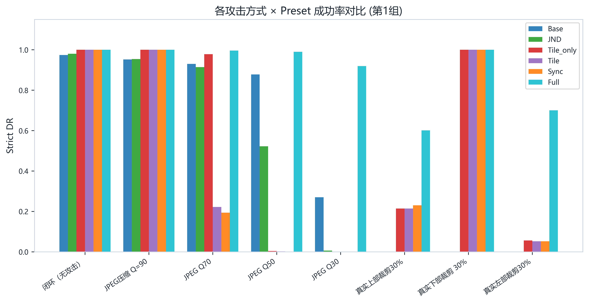

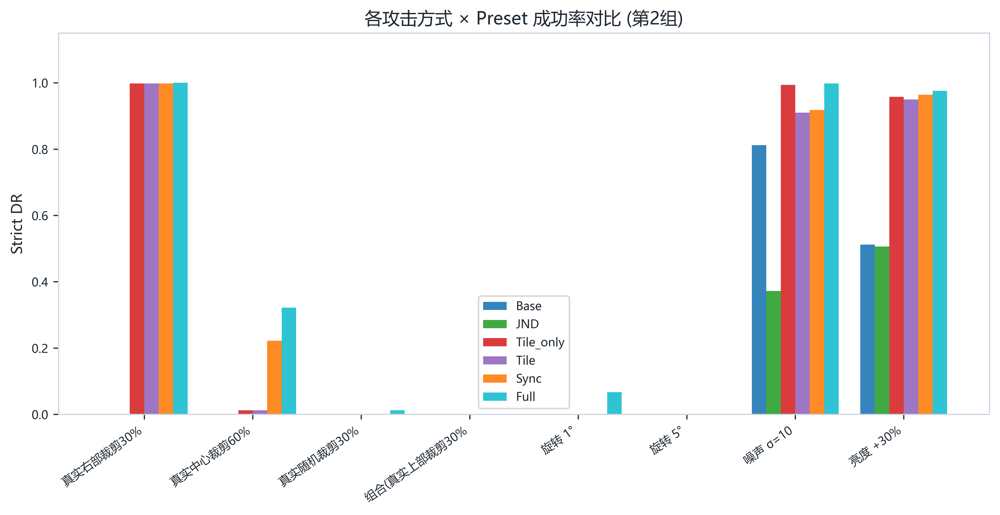

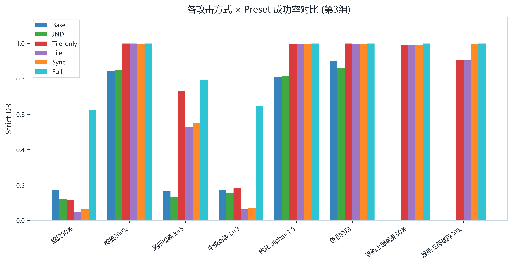

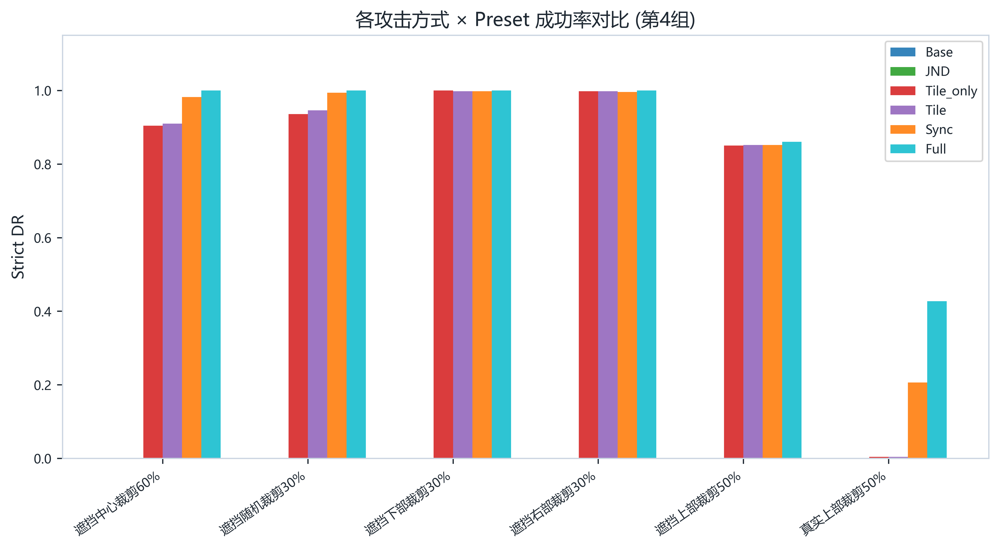

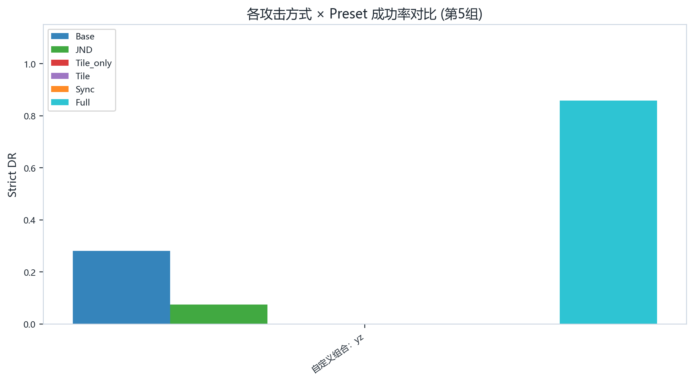

### 6.4 嵌入质量（PSNR vs SSIM）

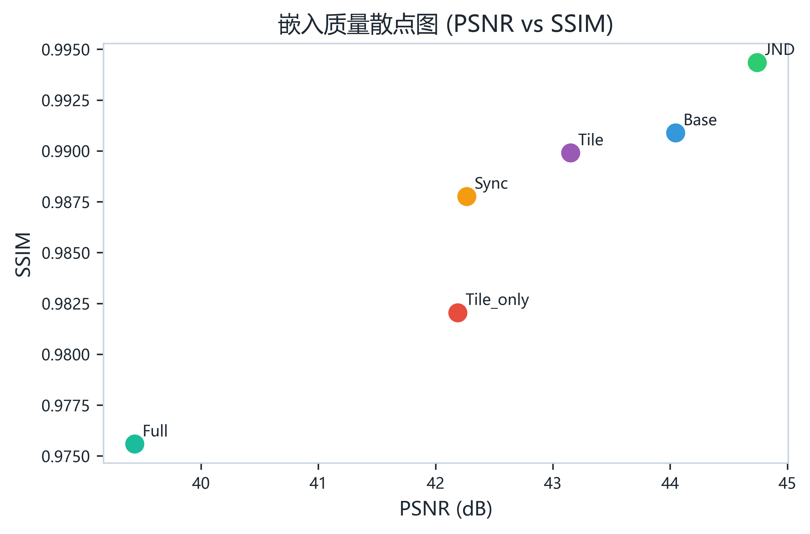

### 6.5 各攻击方式 BER 折线图

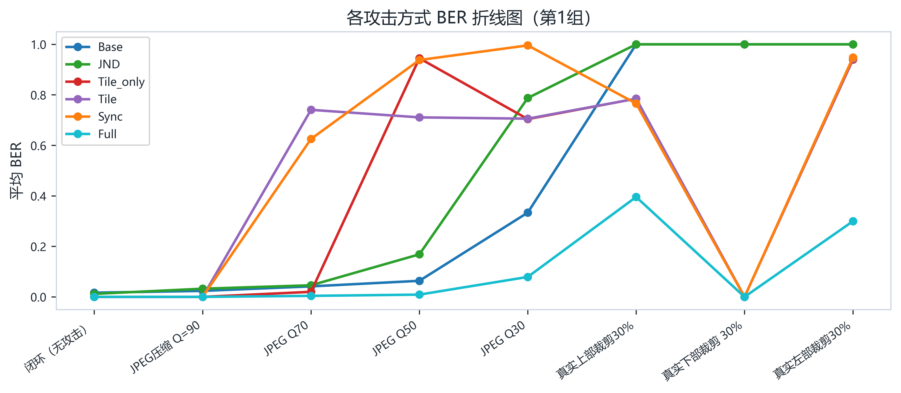

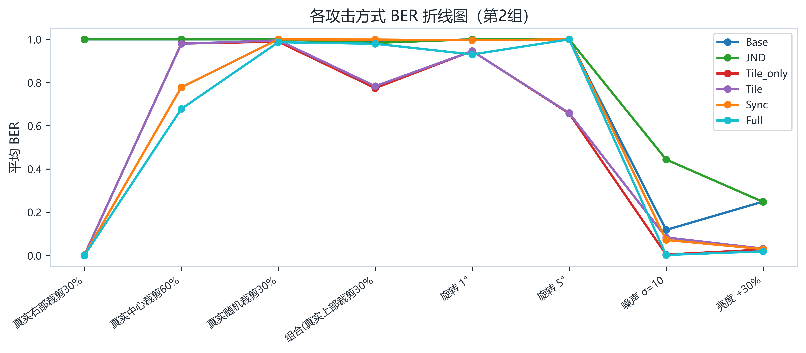

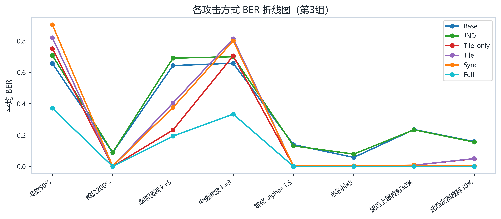

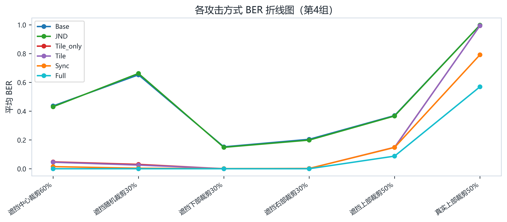

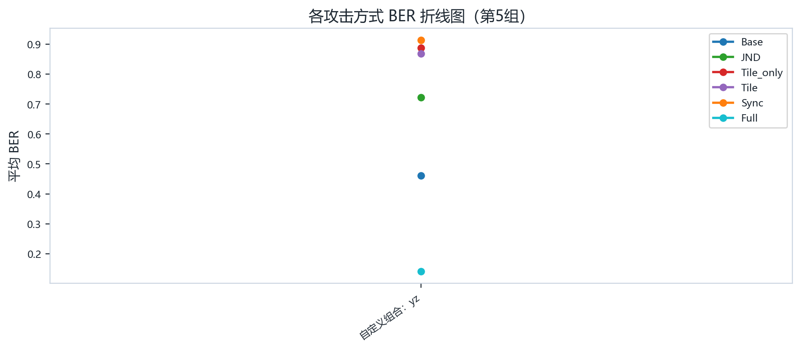

## 7. 原始数据下载（CSV）

以下 CSV 可直接在 GitHub 上预览或下载：

| 文件 | 内容 | 大小 |
|---|---|---:|
| [algorithm_attack_matrix_detail.csv](experiments/data/algorithm_attack_matrix_detail.csv) | 算法对比逐图明细（攻击 × 算法 × 图像，含 PSNR/SSIM/BER/提取文本） | 161 KB |
| [algorithm_attack_matrix_summary.csv](experiments/data/algorithm_attack_matrix_summary.csv) | 算法对比汇总（n、Strict/Soft DR、BER 均值/标准差、耗时） | 3.5 KB |
| [v8_stats_detail.csv](experiments/data/v8_stats_detail.csv) | 消融实验逐图明细（Preset × 攻击） | 159 KB |
| [v8_stats_summary.csv](experiments/data/v8_stats_summary.csv) | 消融实验汇总（PSNR/SSIM/DR/BER/耗时） | 2.0 KB |
| [v8_failure_detail.csv](experiments/data/v8_failure_detail.csv) | 消融实验失败样本明细（失败阶段、置信度、有效单元等） | 37 KB |

## 8. 说明

- 所有数据均由实验工具直接导出，未做人为筛选或修改；
- 报告与图表生成于 2026 年 5 月，不同算法版本/参数下结果可能变化；
- 本仓库仅公开研究成果、文档与演示材料，研究实现源码不在公开范围内。
